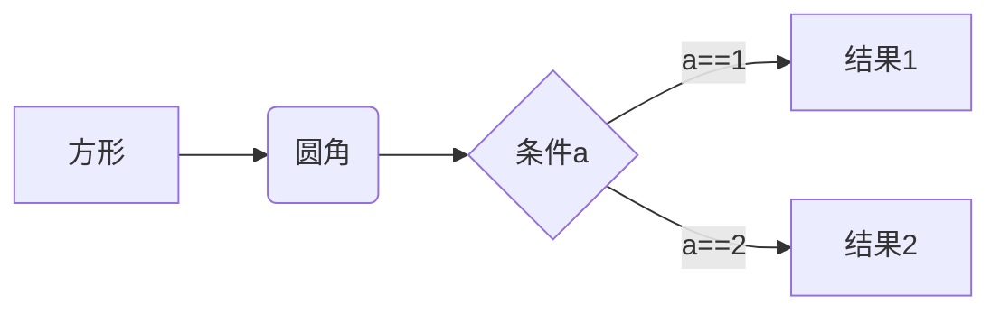

# git笔记

---------------

## 安装git

 

--global 标志整个电脑的文件操作者都是这个

 

 

## 创建版本库

方法1、先建文件夹，在运行git bash输入git init

方法2、使用第三方软件

 

添加到版本库中（注意不能用windows自带的记事本打开任何文本文件，会导致文件乱码）

 

第一步 添加到暂缓区 git add 文件名（eg：git add readme.txt）

第二步 提交到仓库  git commit -m “ 这里用来备注，注释”

 

（commit是一次性把暂缓区里面的文件全部提交）

 

 

git status 可以查看仓库状态

git diff readme.txt 可以对照看出修改了文件那些地方

 

 

 

git diff HEAD  --  readme.txt  看工作区和仓库里面的区别

 

## 版本回退

$  git log 查看各个版本修改的时间与备注，还有版本号

$  git log --pretty=oneline  上面功能的简洁介绍版

 

版本回退可以使用

git reset  --hard HEAD^  (几个^表示回退几个)

 

可以使用

git reset --hard 版本号 (回退到指定版本)

 

Git reset HEAD readme.txt 把暂缓区的修改撤销回到版本库里面最新的

 

也可以用 git  reflog来显示版本号以及备注

 

 

 

 

##  管理修改

$  git cat readme.txt 显示仓库里面版本文件的内容

$  git checkout  --  readme.txt 可以撤销暂缓区或者工作区里面的（但不能撤销版本库里面的）

 

删除文件

$ rm readme.txt 删除文件（删除的是工作区的文件，版本库内还没删除）

如果需要在版本库内也删除就

$ git rem readme.txt

如果不是要删除，就撤销

$  git checkout --  readme.txt

 

 

## 远程仓库

连接本地仓库和github的仓库

 

 

步骤一、点击new

 

 

注意设置

 

 

不要勾选Initialize

 

步骤二、在本地下打开 git bash

输入

$ ssh-keygen -t  rsa  -C “ [2649760868@qq.com”](mailto:2649760868@qq.com\”)

生成的一对秘钥在C:\Users下（.ssh里id_rsa是私钥 id-rsa.pub是公钥）

 

 

 

步骤三、在github个人中心的Setting中

 

找到ssh  keys

点击绿色的new ssh key，

Tittle 随意填，在key文本框内填入id-rsa.Pub的内容

 

 

## 添加远程库

git remote add origin (这里再加上github上复制下来关联码)

 

如果关联错了可以这样修改

$ git remote -v  查看关联仓库连接

$ git remote set-url origin （再加上关联连接） 

 

## 文件推送到远程

第一次推送使用

git push -u origin master

可以吧本地与远程关联起来

 

在之后的推送中就直接使用

$ git push origin master 来推送文件 

# markdown笔记

------------------------------------

后面加两个空格表示换行

# 一级标题  

##   二级标题   

*斜体*  
**加粗**   
<u>下划线</u>  
角标[^r1]

~~sss~~

[^r1]: 角标的内容是

列表：  

* 一  
* 二  
* 三   

- 一  
- 二  
- 三    

+ 一  
+ 二  
+ 三  

1. 一  
2. 二  
3. 三  

1. 第一级   
   - 第二级  
   - 第二级  
     - 第三级

>一
>
>>二
>>
>>>三

> 区块一  
>
> 1. 一  
> 2. 二  

- 第一项

  > 第二级 （四个空格可以直接按Tab键） 
  > 第二级  

`printf()`输出

	区块的使用
	的方法
	（按TAB）

这是一个[链接](https://www.baidu.com)

这是一个直接链接<https://www.baidu.com>    

# 高级链接

这是一个[高级链接][1]

[1]:http://www.baidu.com

# 图片的使用方法  

  
  

这是一个[photo][1]

[1]:http://static.runoob.com/images/runoob-logo.png

#定义图片大小  

#表格  

| 一   | 二   | 三   |
| ---- | ---- | ---- |
| d    | d    | d    |

| 表头一 | 表头二 | 表头三三三三 |
| -----: | :----: | :----------- |
| 右对齐 |  居中  | 左对齐       |
|   单元 |  单元  | 单元         |

<kbd>按键模块</kbd>+<kbd>按键2</kbd>

转义字符，以区别于加粗（**使用反斜杠加星号）

\*\*

$$
A+B
$$

